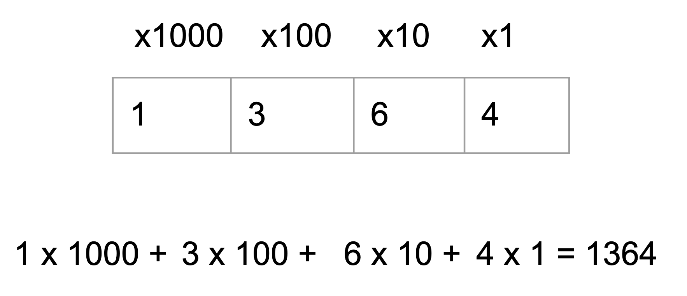
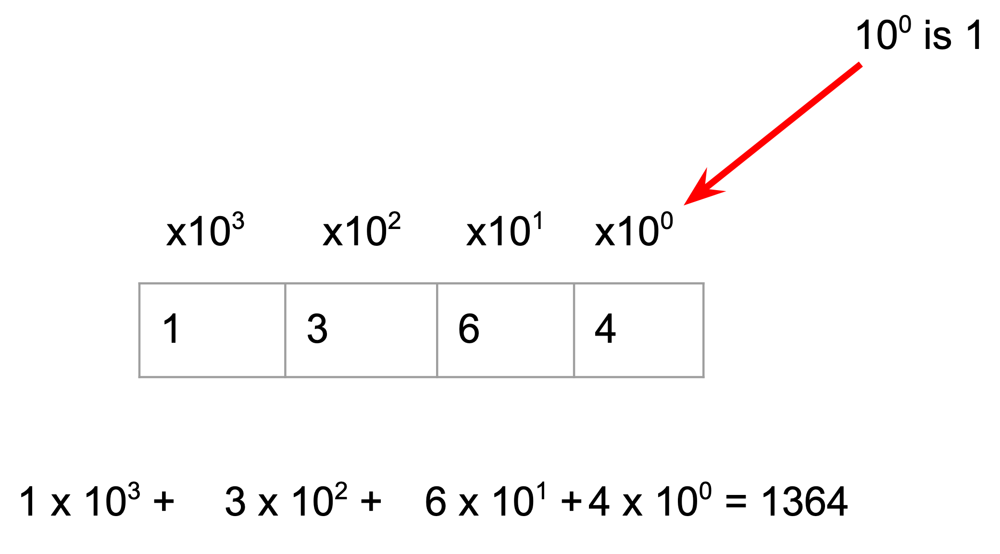
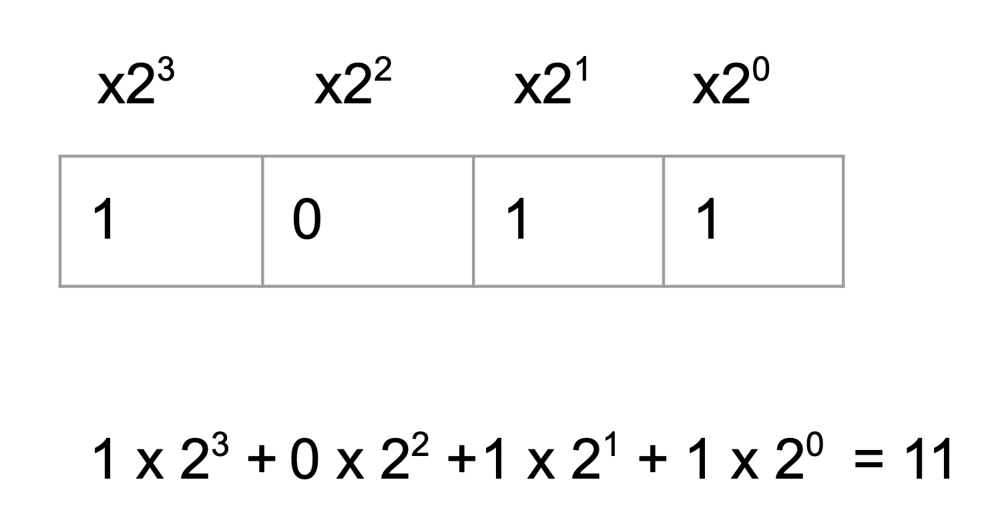
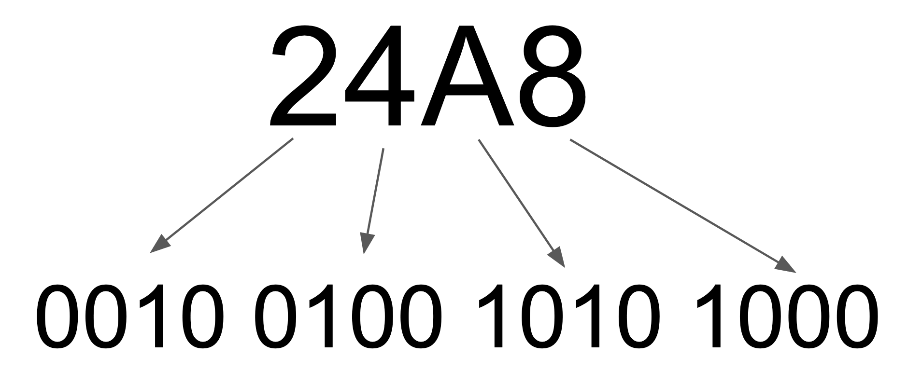
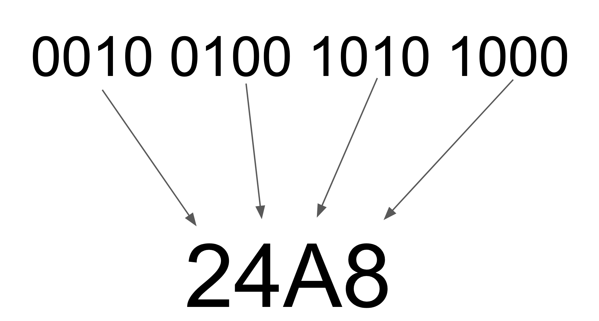
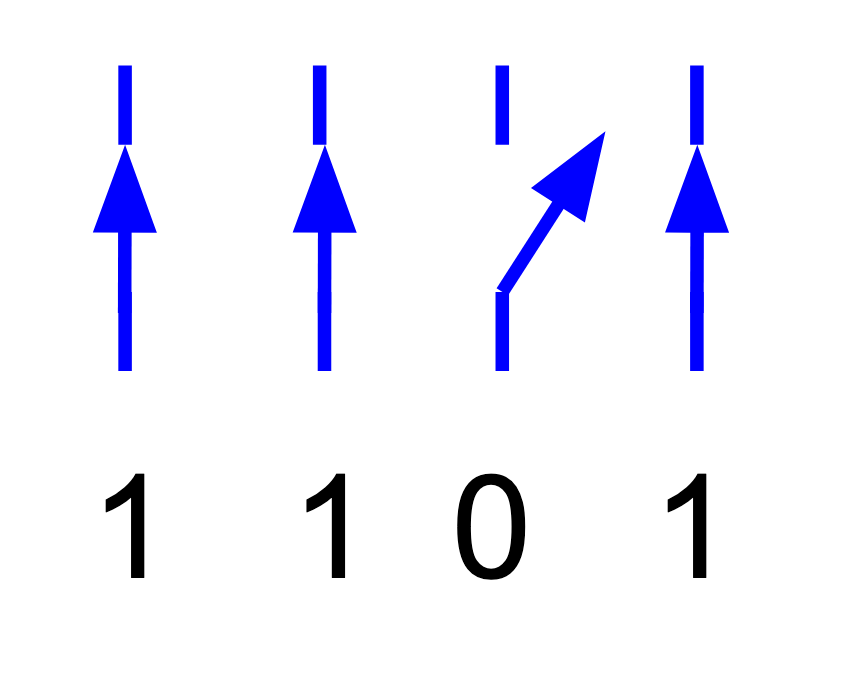

Example Page
==============

The following page is an example of what can be done with 
the PUMPT platform. 

.. raw:: html

   

Before we get to the bits, let's start with the number system we use every day: **DECIMAL**

The decimal numbers system uses ten different symbols: 0, 1, 2, 3, 4, 5, 6, 7, 8, 9.
If we only used these symbols and *nothing else*, we could only represent ten different values.

To represent higher numbers we make use of a **sequence** of these symbols, and assign meaning to the **order** of the symbols in the sequence.
Without sequence and order we would have to invent more symbols, one for each value we want to represent.
This is obviously not very useful!

You probably haven't thought about this (well not recently, anyway) but the **position** of a symbol (or **digit**) in a decimal number defines
the value being represented.

Looking at the sequence of digits in a number like 1364 (one thousand, three hundred and sixty four) we see that the amount contributed to the
overall value increases by a power of ten for each position in the sequence starting from the right.

In this case the rightmost digit is still a power of 10. It is four times ten to the zero.

The decimal number system uses powers of ten.  We can invent other number systems that use powers of other values.
In particular, if we use only two symbols, 0 and 1, and powers of two, we have the **binary** number system that we use in computers.

This shows that the binary number 1011 is representing the **decimal** number 1x8 + 0x4 + 1x2 + 1x1 = 11.

.. raw:: html

          

                
The number 101 in binary is <input type="text" id="Q1" data-component="binary"> in decimal.

                <button type="button" onclick="sendfitb('Q1')">Check</button>
		
	
 

	

To convert from decimal to binary we can divide by 2 repeatedly and write down the remainder as the next digit starting from the right.

::

	To convert 6 to binary we do:

	6/2 is  3+0
	3/2 is  1+1
	1/2 is  0+1

	So the answer is 110

Try these questions:

.. raw:: html

          

                
The number 13 in decimal is <input type="text" id="Q2" data-component="binary"> in binary

                <button type="button" onclick="sendfitb('Q2')">Check</button>
		
	
 

	

.. raw:: html

          

                
The decimal number 15 in binary is:

		<form name=Q3 id="Q3" data-component="binary">
		<input type="checkbox" id="Q3A1" value=""><label for="Q3A1">1101</label>    		<input type="checkbox" id="Q3A2" value="correct"><label for="Q3A2">1111</label>    		<input type="checkbox" id="Q3A3" value=""><label for="Q3A3">11111</label>    		<input type="checkbox" id="Q3A4" value=""><label for="Q3A4">11110</label>    
                <input type="button" value="Check" onclick="sendmcq('Q3')"> 
		</form>
		

	

Binary numbers take up more space than decimal!

For example, the number 9384 in decimal is
10010010101000 in binary.

One way to save space is to use another number base, other than 2 or 10, to represent the number.

If we choose a number for the base that is also a power of two it makes it easy to convert each "digit" into binary and so convert the whole number.

The most common base used in computing is base 16, usually called HEXADECIMAL.

.. note:: The word hexadecimal comes from the Greek "hex" for six and Latin "deci" for ten.

          Originally the British called base 16 "Sexadecimal" from the Latin word "sex" for six.  It didn't catch on.

For hexadecimal or base 16 we need 16 different symbols, so we use 0 to 9 and A to F.

::

      digit  binary decimal
	0    0000      0
	1    0001      1
	2    0010      2
	3    0011      3
	4    0100      4
	5    0101      5
	6    0110      6
	7    0111      7
	8    1000      8
	9    1001      9
	A    1010     10
	B    1011     11
	C    1100     12
	D    1101     13
	E    1110     14
	F    1111     15

So now it is easy to convert to and from binary because each digit in the hexadecimal number represents a number in the range 0-15.

For example, the number:

10010010101000 in binary can be written

   24A8

This is much shorter!

If we take each digit in the hex number and convert it we get:

That gets us back to the original number.

We can also do the reverse easily - convert a binary number to hexadecimal:

Once you memorise the binary patterns corresponding to each hex digit, you'll find it super easy to convert from binary to hex and back.

----------------------------
Why do computers use binary?
----------------------------

Now that you know how to handle binary numbers you might be wondering why we're doing this.
Why do we need to know about binary numbers when working with computers?

The answer is very simple: computer memory and logic is built out of devices that are essentially switches. They can be ON or OFF and nothing else.
In a computer, you can't have a switch that is half on or half off!

So if we think of a switch that is ON representing 1 and OFF representing 0, we have all the digits we need to represent binary numbers.

Memory in computers consists of a large number of these switches. Their "position" or "state" (on or off) represents binary digits (1 or 0).
So we can represent numbers with a sequence of these switches.

For example, the number 13 in decimal is 1101 in binary:

We can also do logic (and, or, not) operations on binary numbers very easily. With combinations of logic operations we can
do arithmetic operations (add, subtract, negate, multiply etc).

.. note:: In the past there have been computers that used other number systems instead of binary.
   For example, a computer that used base 3 or "ternary" numbers where there are three digits 0, 1, 2.
   This requires electronics that can be in three states rather just two (on/off).

   Theoretically, computers that use higher bases such as 3 or more, have a lot of advantages. Less digits
   required to represent a number for example. Unfortunately, the major practical problem is that it is
   a lot more complex to build the multi-valued elements that represent each digit.

   Today, computers are almost universally binary.

Binary is a method of representing numbers with just two digits, 0 and 1.

A key idea that we will now explore is that **almost any** information can be represented with numbers and in particular binary numbers.
In the next section we start by looking at how we represent numbers.

.. raw:: html

   
 
   How confident are you that you understand binary?
   <form id = "C4" data-component="binary">
      Not confident
   <input type="radio" name="C4" id="C4A1">
   <input type="radio" name="C4" id="C4A2">
   <input type="radio" name="C4" id="C4A3">
   <input type="radio" name="C4" id="C4A4">
   <input type="radio" name="C4" id="C4A5">
   Very confident
   <input type="button" value="Submit" onclick="sendlik('C4','binary')"> 
   </form>
   

-------------
Binary: Video
-------------

.. raw:: html

      
   <iframe align="left" width="500" height="281" src="https://www.youtube.com/embed/5mbpnES7Q1c" frameborder="0"  allowfullscreen></iframe>
 
  
&nbsp;
 
&nbsp;
 
&nbsp;
 
&nbsp;
 
&nbsp;
 
&nbsp;

[Next: `1.2 Numbers <1-2-numbers.html>`_]

