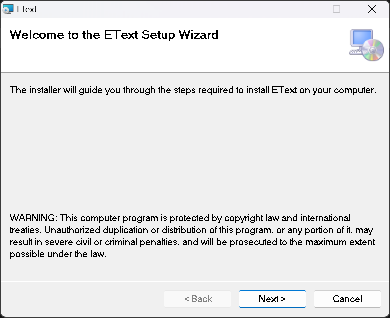
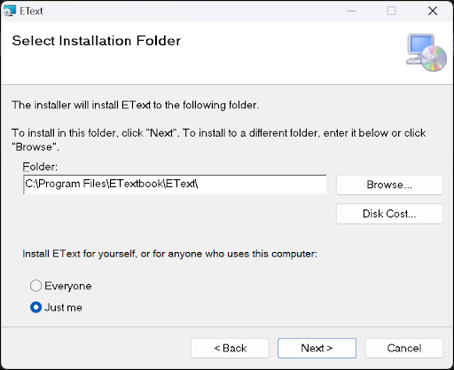
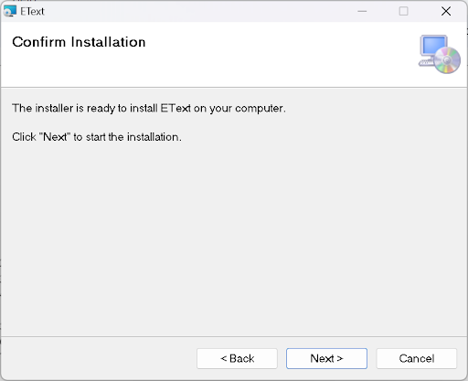
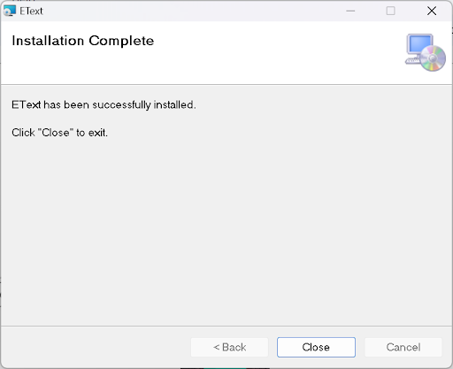
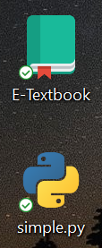
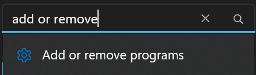
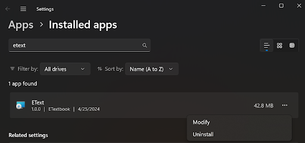
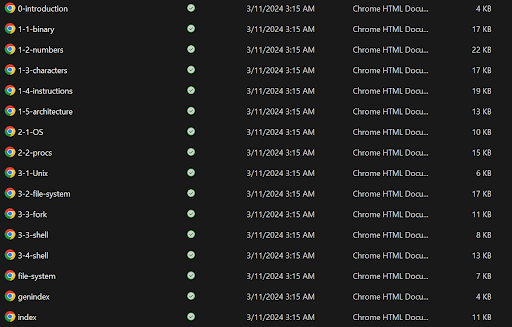
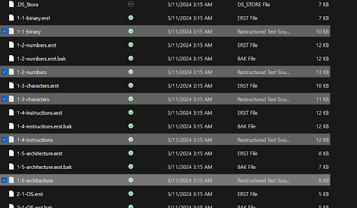
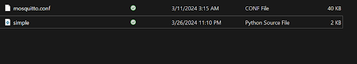

############################################
E-Textbook Installation Guide (Windows)
############################################

**Dependencies**
==================
These dependencies are necessary to make the most of the E-textbook’s architecture, including OLM access and the ability to make your own pages.

WSL (Linux)
---------------
A Windows Subsystem for Linux allows you to run a Linux environment on Windows. This is vital as this is how we’ll be interacting with the textbook to run the pub-sub server and create pages. 
Personally, I use Ubuntu, as it is pretty simple to use. 
Ubuntu can be installed `here <https://ubuntu.com/download/desktop>`_. Alternatively, you can install it by typing into your terminal:

.. code-block:: python

    wsl --install

If you install Ubuntu, it will be helpful to know where your files are stored. Your files will probably be stored in:

.. code-block:: python
   
    C:\\Users\\yourUsername\\AppData\\Local\\Packages\\CanonicalGroupLimited.UbuntuonWindows_79rhkp1fndgsc\\LocalState\\rootfs\\home\\ubuntuusername

"yourUsername" will be whatever your username on your machine is. ubuntuusername is the username you will create the first time you run Ubuntu.
If you’re using Ubuntu, you should also run:

.. code-block:: python
    
    apt-get update

This will ensure that all of Ubuntu's packages are properly up to date.

Python3
--------------
In order to run the necessary functions, Python3 must be installed on your computer. You can install python from the `Python Website <https://www.python.org/downloads/windows/>`_. Alternatively, in Ubuntu you can type:

.. code-block:: python
   
    sudo apt install python3

It will also help if you add python to your PATH.
In environment variables, add the path:
``C:\\Users\\yourUsername\\AppData\\Local\\Programs\\Python\\Launcher\\``

Mosquitto
-----------
Our publish/subscribe path uses mosquitto, which can be installed from the `Mosquitto Website <https://mosquitto.org/download/>`_. If you use the installation wizard, this step isn’t necessary as the wizard will download mosquitto for you. If something goes wrong with the wizard, or you choose to download from Github instead, then you can download mosquitto manually. 

Sphinx
-----------
This textbook uses Sphinx to create HTML pages from Restructured Text files. If you wish to edit pages, I recommend following `this tutorial <https://www.sphinx-doc.org/en/master/tutorial/index.html>`_ first. Type the following into Ubuntu in order to download Sphinx:

.. code-block:: python
    
    apt-get install python3-sphinx

If you get a permission denied error, first type:

.. code-block:: python
    
    sudo su root

and put in your Ubuntu password. Then try ``apt-get install python3-sphinx`` . If that still doesn’t work, then make sure you’ve run:

.. code-block:: python
    
    apt-get update

You can verify that sphinx is properly installed by running: 

.. code-block:: python
    
    sphinx-build --version

This should output sphinx-build 7.1.2 or whatever version of Sphinx you have.

Paho-mqtt
-----------
To download  paho-mqtt, which is another part of our pub/sub, simply type into Ubuntu:

.. code-block:: python
    
    pip install paho-mqtt

**Installation**
===================
Via installation wizard
---------------------------------
This method is recommended for people who wish to read the textbook. If you wish to edit/create new pages, I recommend setting your installation path in step 2 to “home” in Ubuntu.  

Click “Next”.

Click “Browse” to choose where to install the textbook. This will be about 100 MB. 
If you're using Ubuntu and want to be able to make and edit your own pages, download this into:

.. code-block:: python

    C:\\Users\\yourUsername\\AppData\\Local\\Packages\\CanonicalGroupLimited.UbuntuonWindows_79rhkp1fndgsc\\LocalState\\rootfs\\home\\yourubuntuusername

Choose whether to download the textbook for everyone on the PC or just yourself.
Click “Next”.

Click "Next" one more time to download the textbook. If a pop-up appears, click “Yes”.

Click “Close”.
Congrats! The textbook is now downloaded on your device! You can open the introduction to the textbook through the shortcut on your desktop or by searching for it on the start menu. Double clicking on the shortcut to simple.py will open simple.py in your preferred code editor (assuming you have one).

Pictured above: shortcuts to the textbook (``\\build\\html\\0-introduction.html``), and simple.py (``\\Simple\\simple.py``)

Uninstalling the textbook
--------------------------

If you wish to delete the textbook, simply search in settings for “add or remove programs”:

Then search for “EText”, click the 3 dots and click “uninstall”:

If a pop-up opens, click “Yes”. The textbook will then be uninstalled.

Via Github
-----------

This installation method is recommended for developers who want to edit the pages and be able to push their changes to Github. No shortcuts will be created, and you’ll have to download mosquitto manually.

`Download the textbook from Github <https://github.com/bobkummerfeld/Etext/tree/main>`_. 
Make sure the code is in the “home” folder of your Ubuntu. 

The HTML pages will be under “\\Etext\\build\\html”:

Clicking on any of these HTML files will open the page in your preferred browser. This folder is also where the pages you create will be stored.

The RST files, which are the sources for the HTML pages, will be found in “\\Etext\\source”. Editing these are how you edit the HTML pages: 

The Restructured Text Files highlighted above are the types of files that you’ll edit to change the HTML pages.

Simple.py can be found in "\\Etext\\Simple\\simple.py". You run this in order to listen for pub/subs. You should also replace the mosquitto.conf that you downloaded in your Program Files with the one in this folder:

Pictured above: simple.py and mosquitto.conf.

**Editing Pages**
===================
Once you’ve installed the textbook and Sphinx as shown above, you can edit HTML pages or even add more. The steps to doing so are listed below. 

Navigate to “\\Etext\\source”. If you get the error “Cannot access ‘Etextbook’: directory not empty”,  take the “Etext” folder out of “Etextbook”, and delete “Etextbook.” You should then be able to cd into “Etext” without issue. 
Open any of the .rst files, or add your own. 
Edit the .rst files however you want. I recommend following the Sphinx tutorial before attempting this. If you get a permission denied error when trying to save your file, you probably downloaded the textbook into your Program Files. Try putting them into your Ubuntu folder instead.  
Once you’ve created/edited the RST file, you have to build/rebuild the HTML page. Do this by navigating to “\\EText” in Ubuntu and type:
	
.. code-block:: python
    
    make html 
	
If  you get the error “Permission Denied” when attempting to cd into “\\EText”, see the section on Permission Denied. 
If you get the error “Could not import extension sphinxcontrib.bibtex”, then run:

.. code-block:: python
    
    pip install sphinxcontrib-bibtex

If done properly, then your HTML pages will be in “\\Etext\\build\\html.” Clicking on them will open them in your browser.

**Running Mosquitto**
======================
Mosquitto is our pub/sub program. Instructions to run it are below:

Open a terminal as Administrator.
In the terminal, navigate to the folder in which "mosquitto.conf" is stored. For me this is “C:\\Program Files\\mosquitto”.
Type "mosquitto -v -c <path to mosquitto.conf>" into the terminal. This will run mosquitto in the background. 
Run simple.py and open one of the HTML files. You should start receiving messages.

**Running simple.py**
=========================

In order to send messages, you have to run simple.py. Fortunately this is pretty simple. There are two straightforward ways to run it:

Preferred Method: Navigate to "\\Etext\\Simple\\simple.py" and run it in your preferred code editor. Visual Studio Code seems to be the most consistent when it comes to running simple.py. Even running it in Ubuntu can cause issues.

Navigate to “\\Etext\\Simple\\simple.py" in Ubuntu and type:

.. code-block:: python
    
    python3 simple.py

See common errors here. Also keep in mind that simple.py will likely return an error if you don’t have mosquitto running first. 

**Personis**
==============

In order to create our Open Learner Model, we use the Personis system. Download Personis `from this link <https://www.dropbox.com/scl/fi/z0x3msh1uswpwww224sb8/B2A-new.tgz?rlkey=77qtjqoxyhmep12ygzmk0s4uc&dl=0>`_.  Make sure you put it into your Ubuntu directory, which will typically be at:

.. code-block:: python

    C:\\Users\\username\\AppData\\Local\\Packages\\CanonicalGroupLimited.UbuntuonWindows_79rhkp1fndgsc\\LocalState\\rootfs\\home\\ubuntuusername

Next, unpack the Dropbox files by running the command:

.. code-block:: python

    tar zxvf B2A-new.tgz

This should unpack the files into your Ubuntu.
You’ll have to change a couple of files in order to get it working. First, in /B2A/activate/bin , the file called “activate” needs line 40 changed to:

.. code-block:: python

    VIRTUAL_ENV="/home/ubuntuUsername/B2A/activate"

Replace “ubuntuUsername” with your Ubuntu Username. 

Next, in /B2A , in the file named “doall”, change line 14 to:

.. code-block:: python
    
    PERSONISPATH=/home/ubuntuUsername/B2A/Personis

Again replace “ubuntuUsername” with your Ubuntu Username. The path should be wherever you put the files from Dropbox.

Now you’re all set to run Personis! First, cd into /B2A/PUML and run:

.. code-block:: python
    
    python3 -m venv Personis

Then run: 

.. code-block:: python

    source Personis/bin/activate

Next, cd into /B2A/PUML/Personis and run: 

.. code-block:: python
    
    pip3 install simplejson requests

Then cd into /B2A/PUML/Personis/Personis and run: 

.. code-block:: python
    
    ./Tests/base-tests

When it asks what directory to use, press enter. Then if it asks if you want to recreate the model, type y. Then press enter when it says “CR for all”. This should run the tests, and the output should look like this: 

::

    ====================================================================
                            Tests/Base/example01_add.py
    ====================================================================
    add evidence to Alice's model
    2024-05-19 20:49:42,424 >>>>Access: Alice::Tests/Models
    ===================================================================
    Now check the evidence list for Alice's names
    ===================================================================
    Component:  First name
    ===================================================================
    showobj:
    Identifier = firstname
    Description = First name
    Explanation =
    component_type = attribute
    value_type = string
    value_list = None
    value = Alice
    resolver = None
    goals = []
    evidencelist = [{'flags': [], 'evidence_type': 'explicit', 'source': 'alice', 'owner': 'alice', 'value': 'Alice', 'comment': None, 'creation_time': 1716166182.4706335, 'time': None, 'useby': None, 'objectType': 'Evidence'}]
    objectType = Component

    .
    .
    .
    .
    .
    ---------------------------------
    Continue?

**Common Issues**
====================
Docutils
-----------
If you get an error with docutils, then make sure you install version 0.20.1.

Permission Denied
----------------------
If you get the “Permission Denied” Error in Ubuntu, then type in ``sudo su root`` and enter your Ubuntu password. This will give you root access, giving you sufficient permission to cd into the directory and ``make html``:

:: 
    
    yourUsername@LAPTOP:~/docs$ make html
    make: Makefile: Permission denied
    make: *** No rule to make target 'html'.  Stop.
    yourUsername@LAPTOP:~/docs$ sudo su root
    [sudo] password for yourUsername:
    root@LAPTOP:/home/yourUsername/docs# make html
    sphinx-build -M html "source" "build"
    Running Sphinx v7.1.2
    loading pickled environment... checking bibtex cache... up to date
    done
    building [mo]: targets for 0 po files that are out of date
    writing output...
    building [html]: targets for 0 source files that are out of date
    updating environment: 0 added, 0 changed, 0 removed
    reading sources...
    looking for now-outdated files... none found
    no targets are out of date.
    build succeeded.

    The HTML pages are in build/html.

TypeError: Client.__init__()
---------------------------------
If you get the error: “TypeError: Client.__init__() missing 1 required positional argument: 'callback_api_version'”. 

Change line 37 in simple.py from:

.. code-block:: python
    
    client = mqtt.Client()

to:	

.. code-block:: python

    client = mqtt.Client(mqtt.CallbackAPIVersion.VERSION1)

If that doesn’t work, then you can try installing an older version of paho-mqtt using:

.. code-block:: python
    
    pip install "paho-mqtt<2.0.0"

And keep line 37 as ``client = mqtt.Client()``

.. toctree::

